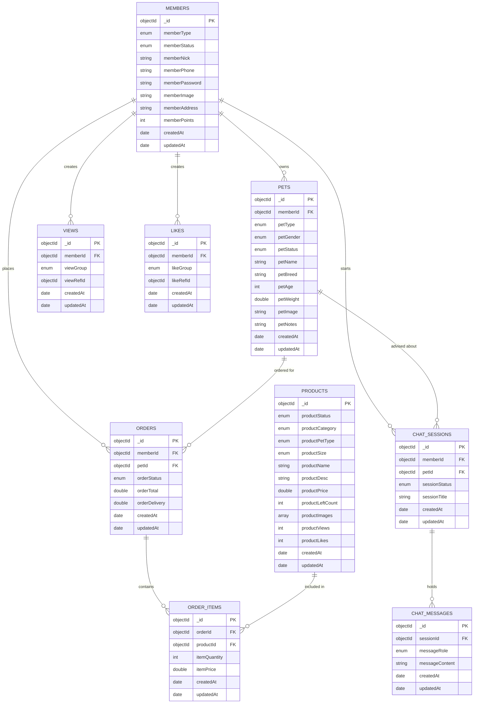

# Data Model

**Database:** MongoDB | **ODM:** Mongoose | **Naming conventions:** carried over from a prior course project

---

## Entity relationship diagram

---

## Enum values

| Enum | Values |
|---|---|
| `memberType` | USER, ADMIN |
| `memberStatus` | ACTIVE, BLOCK, DELETE |
| `petType` | DOG, CAT, BIRD, FISH, RODENT, OTHER |
| `petGender` | MALE, FEMALE, UNKNOWN |
| `petStatus` | ACTIVE, DELETE |
| `productCategory` | FOOD, TOY, HYGIENE, ACCESSORY, HEALTH |
| `productPetType` | DOG, CAT, BIRD, FISH, RODENT, ALL |
| `productStatus` | PAUSE, PROCESS, DELETE |
| `productSize` | SMALL, MEDIUM, LARGE |
| `orderStatus` | PAUSE, PROCESS, FINISH, DELETE |
| `viewGroup` | PRODUCT, PET |
| `likeGroup` | PRODUCT |
| `sessionStatus` | ACTIVE, ARCHIVED |
| `messageRole` | USER, ASSISTANT |

---

## Design decisions

### Conventions

- Every collection carries `_id`, `createdAt`, and `updatedAt`
- Field names are prefixed by their collection (`member*`, `product*`, `order*`, `pet*`)
- Status and category fields are enums rather than free strings
- `orders` and `orderItems` are separate collections — an order holds totals and status,
  its items hold per-product quantity and the price at purchase time
- `views` and `likes` use a polymorphic pattern: a `*Group` enum names the target
  collection and `*RefId` points at the document, so one collection serves several targets
- Denormalized counters (`productViews`, `productLikes`, `productLeftCount`,
  `memberPoints`) avoid recomputing aggregates on every read

### Project-specific decisions

**`pets` is the differentiating collection.** `petType`, `petBreed`, `petAge`,
`petWeight`, and `petNotes` are what later get passed to the AI assistant as context.
Without this, the assistant would give the same generic answer to everyone.

**`products.productPetType`** means every product knows which animal it is for. This
is what lets the catalog filter itself to the customer's registered pet instead of
making them wade through irrelevant listings.

**`orders.petId`** records which pet an order was placed for — not just which customer.
When someone owns a dog and a cat, this is what lets the assistant reference the right
animal.

**Chat is split into `chatSessions` and `chatMessages`,** following the same
parent/child shape as orders and order items. A customer gets a separate conversation
thread per pet, and message history stays queryable.

### Deliberately omitted

- **Social features** (following other members, community articles) — outside the scope
  of this project
- **A `sessions` collection** — the SPA authenticates with JWT, so there is no
  server-side session store for it. The admin panel uses `express-session` separately.
